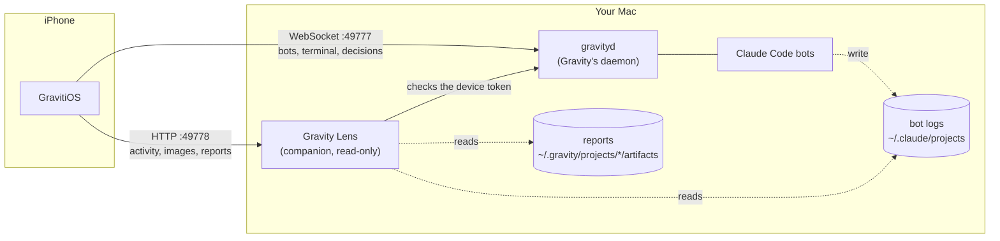

<p align="center">
  
</p>

<h1 align="center">GravitiOS</h1>

<p align="center">
  <b>Follow, steer and rule on your <a href="https://getgravity.build">Gravity</a> bot team from your iPhone.</b><br>
  An open-source iOS client for the Gravity daemon, over your own Tailscale network.
</p>

<p align="center">
  <a href="https://github.com/mrinaldi2/gravity_os/actions/workflows/ci.yml"></a>
  
  
  
  <a href="LICENSE"></a>
</p>

---

[Gravity](https://getgravity.build) runs a team of persistent [Claude Code](https://claude.com/claude-code) bots on your Mac: they hand work to each other, run on schedules and keep going when you close the lid. It has no phone app. **GravitiOS is one**: see what every bot is doing right now, read its work as a story instead of a scrolling terminal, answer the decisions it is waiting on, and start new projects and bots, from anywhere your phone has Tailscale.

> GravitiOS is an independent project. It is not made by, affiliated with or endorsed by the Gravity authors. It speaks Gravity's documented [control-plane protocol](https://github.com/ahilles107/gravity/blob/main/docs/protocol.md).

## Features

|  |  |  |
|:-:|:-:|:-:|
|  |  |  |
| **Activity**: every bot's latest work, with what it is doing right now | **Turns as a story**: the request, replies, messages, folded steps, screenshots | **Every step**: the command and its output, or the file diff |
|  |  |  |
| **Reports**: the team's shared documents, with tables and images | **Decisions**: pick an option or write a ruling and publish it | **Create** projects and bots with Gravity's own avatars |

- **Activity feed.** Every bot's recent turns, newest first, with "working now" at the top: who asked, the step in progress, the latest message, and a summary such as *54 commands · 2 files +510 −0 · 2 messages sent*.
- **Readable turns.** A turn is told in order: what came in, what the bot said and sent, tasks it completed, and the mechanical steps folded into groups. Tap a step for the full command and output or a coloured diff.
- **Images.** Screenshots a bot took or looked at show as thumbnails with a full-screen viewer (swipe, pinch to zoom).
- **Reports.** The project's shared artifacts folder, searchable, rendered as markdown with tables, code and images.
- **Decisions.** Gravity's Control Center: urgent items first, options with the bot's recommendation, answer and publish in one tap, hold, comment.
- **Live terminal.** The bot's real Claude Code terminal ([SwiftTerm](https://github.com/migueldeicaza/SwiftTerm)) with a message box and a key row (esc, return, arrows, 1/2/3, tab, ^C) for permission prompts.
- **Messages, routines and bot details.** The bot's message thread, its routines (enable, run now) and its charter.
- **Create projects and bots** with a name, a charter and one of Gravity's twenty avatars.
- **Resilient.** Reconnects by itself and resumes the terminal from where it left off. The device token stays in the Keychain.

## How it works



- **The daemon** (`gravityd`, part of Gravity) is the source of truth for projects, bots, the terminal, messages and decisions. GravitiOS talks to it with a scoped **device token** you create in Gravity.
- **Gravity Lens** ([`companion/gravity_lens.py`](companion/gravity_lens.py)) is a small, read-only, standard-library Python service. Gravity does not serve the bots' Claude Code logs to clients, so Lens parses them into turns and serves them, along with the reports folder and the images the bots touched. It accepts only a Gravity device token with the `read` grant, verified by the daemon itself, so revoking the device in Gravity cuts off both.
- **Tailscale** carries both over WireGuard. Nothing is exposed to the internet and nothing goes through a third-party server.

## Requirements

| Where | What |
|---|---|
| Mac | [Gravity](https://getgravity.build) 0.13 or later (macOS 14+, Apple silicon) with its daemon running |
| Mac | [Tailscale](https://tailscale.com), and Python 3.9+ (`/usr/bin/python3` ships with the Xcode command line tools) |
| iPhone | iOS 17 or later, with Tailscale signed in to the same tailnet |
| Build | Xcode 16 or later. A free Apple ID is enough to run it on your own phone |

## Setup

### 1. Let the daemon listen on Tailscale

Find the Mac's Tailscale address (`tailscale ip -4`, or in the Tailscale menu), then add it to `bind` in `~/.gravity/gravityd.toml`:

```toml
bind = ["127.0.0.1", "100.x.y.z"]
```

Restart the daemon from **Gravity → Settings → Connection**. This restarts every bot session, so pick a quiet moment. Never bind `0.0.0.0`.

### 2. Install Gravity Lens

```bash
git clone https://github.com/mrinaldi2/gravity_os.git
cd gravity_os
./companion/install.sh
```

This installs a login agent that runs Lens on port 49778, on the same addresses as the daemon. Check it with `curl http://100.x.y.z:49778/health`. Remove it with `./companion/install.sh uninstall`.

### 3. Create a device token

In Gravity on the Mac: **Settings → Devices → add a device** with `read`, `control` and `approve`. Copy the token: it is shown once.

| Grant | Lets the phone |
|---|---|
| `read` | see bots, activity, terminals, reports and decisions |
| `control` | type into terminals, send messages, create projects and bots, run routines |
| `approve` | answer and publish decisions |

### 4. Build and install the app

Create `Config/Local.xcconfig` (it is git-ignored) with your signing team and a bundle identifier of your own:

```
DEVELOPMENT_TEAM = ABCDE12345
PRODUCT_BUNDLE_IDENTIFIER = com.yourname.gravitios
```

Open `GravitiOS.xcodeproj`, choose your iPhone and press **Run**. Your team ID is in Xcode → Settings → Accounts.

### 5. Connect

Open GravitiOS and enter the Mac's Tailscale address, port `49777` and the device token.

## Try it without your own bots

The screenshots above come from a demo world: a fictional team building a notes app, with projects, bots, decisions, activity, reports and images. You can run it too. It starts a throwaway daemon with Gravity's test runtime, so no Claude sessions run and no tokens are spent:

```bash
python3 demo/make_demo.py --serve
```

Then run the Debug build in the simulator with the launch arguments it prints (`-gravHost`, `-gravPort`, `-lensPort`, `-gravToken`). Everything lives in `/tmp/gravitios-demo`.

## Security and privacy

- GravitiOS talks only to your daemon and your Lens. No analytics, no crash reporting, no accounts. The one exception: a report that embeds a web image loads that image from the web.
- The device token is stored in the iPhone Keychain (this device only, after first unlock).
- Traffic is plain HTTP and WebSocket inside your tailnet; Tailscale encrypts it end to end. Bind the daemon and Lens only to loopback and your Tailscale address.
- Lens is read-only. It serves only bot logs, the artifacts folder and images that a bot's log or a report refers to, and writes nothing but a thumbnail cache in `~/Library/Caches/GravityLens`.
- A lost phone: revoke its device in Gravity. The daemon and Lens both refuse it immediately.

See [SECURITY.md](SECURITY.md) to report a vulnerability.

## Troubleshooting

| Symptom | Fix |
|---|---|
| The app keeps retrying | The daemon is not listening on the Tailscale address: check `bind` and restart it. From the Mac, `curl http://100.x.y.z:49777/health` must answer. |
| "Token rejected" | The token was mistyped, revoked, or copied incompletely. Forget the daemon in Settings and paste it again. |
| Activity says "Gravity Lens not reachable" | Run `./companion/install.sh`, then `curl http://100.x.y.z:49778/health`. Its log is `~/.gravity-lens/lens.log`. |
| Lens stops after a reboot | It needs the Tailscale address to exist; launchd restarts it every 15 s until Tailscale is up. |
| The terminal looks narrow on the Mac | The terminal is shared: opening it on the phone resizes it for every client until the Mac resizes it again. |
| No notifications in the background | iOS suspends the app; alerts fire only while it is open or just backgrounded. There is no push server. |

## Project layout

```
GravitiOS/            the SwiftUI app
  Core/               daemon client (WebSocket), Lens client, state, Keychain
  UI/                 screens
companion/            Gravity Lens (gravity_lens.py) and its installer
demo/                 the demo world generator and its images
tests/                Lens tests (python3 -m unittest discover tests)
Config/               Info.plist, Signing.xcconfig (+ your git-ignored Local.xcconfig)
```

## Contributing

Issues and pull requests are welcome. See [CONTRIBUTING.md](CONTRIBUTING.md).

## License

[MIT](LICENSE). The bot avatars come from [Gravity](https://github.com/ahilles107/gravity) (MIT); see [THIRD_PARTY_NOTICES.md](THIRD_PARTY_NOTICES.md).
