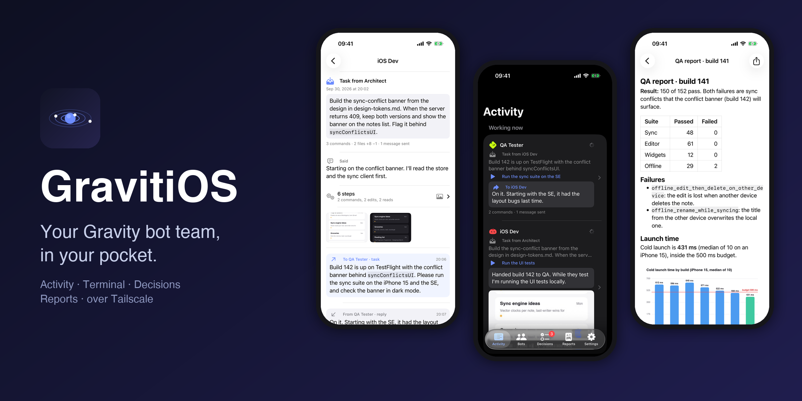
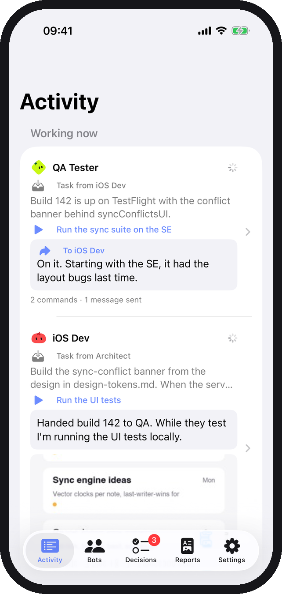
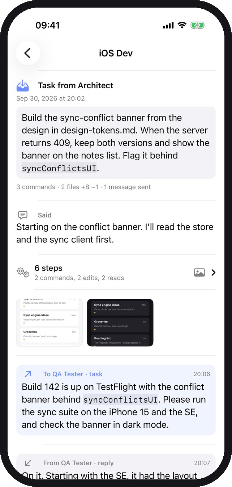
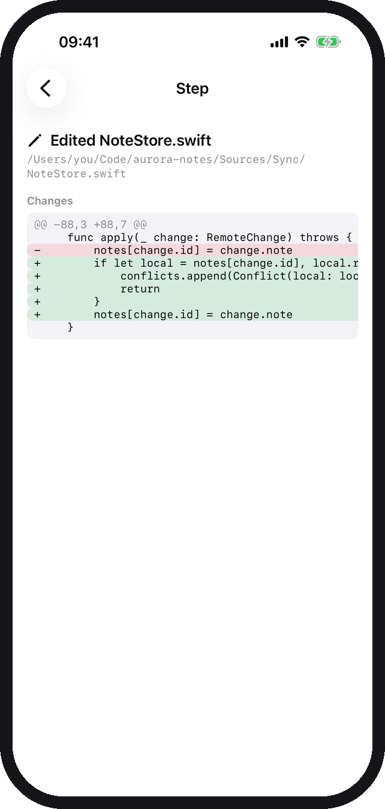
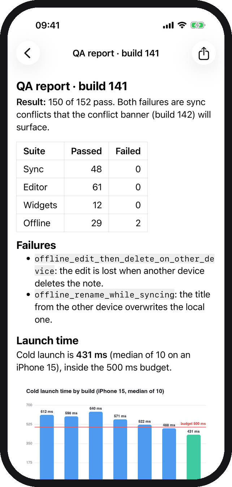
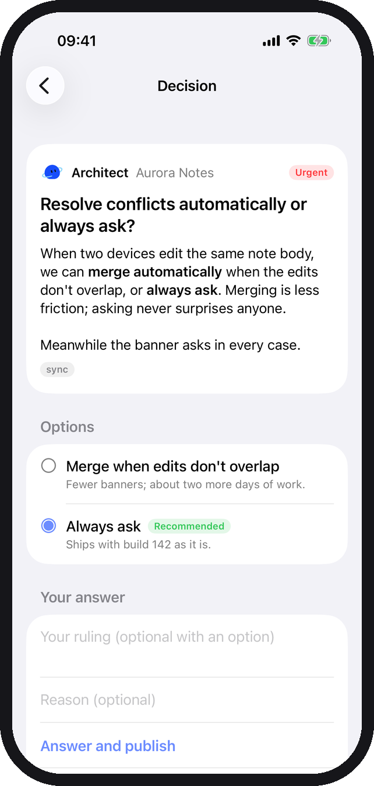
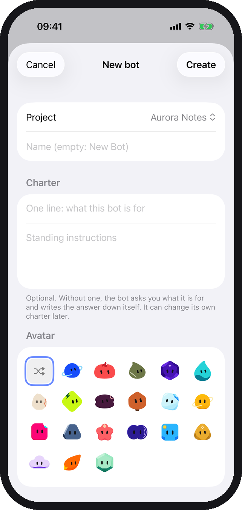
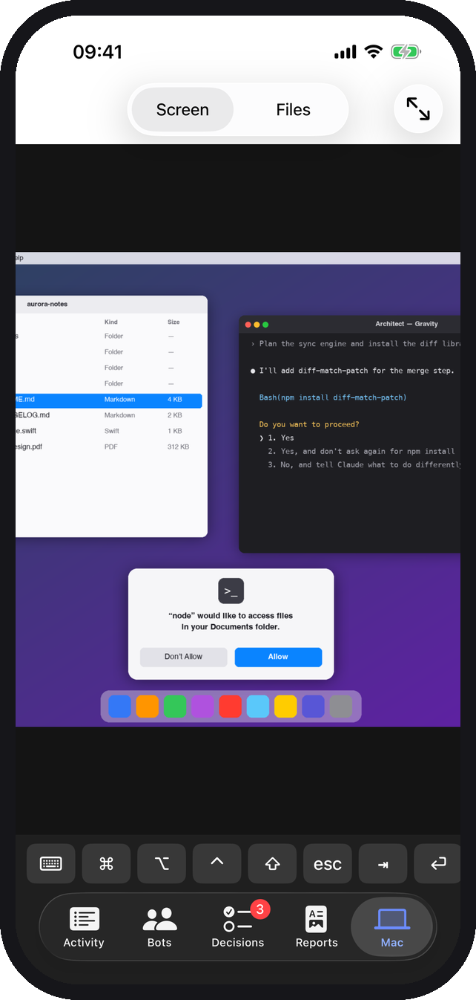
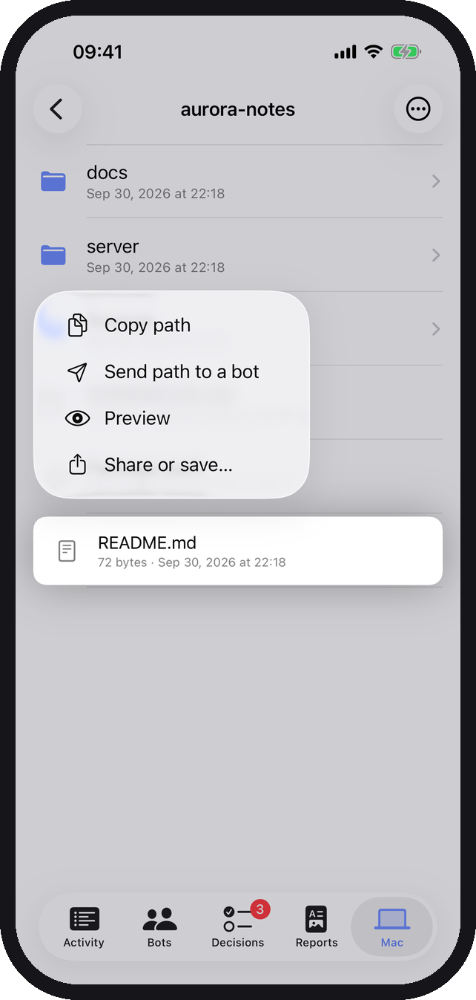
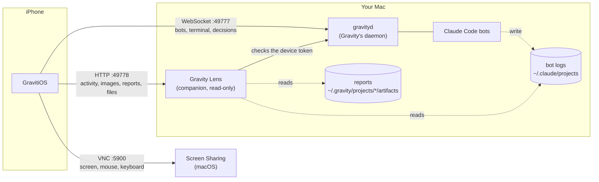

<p align="center">
  
</p>

<h1 align="center">GravitiOS</h1>

<p align="center">
  <b>Follow, steer and rule on your <a href="https://getgravity.build">Gravity</a> bot team from your iPhone, and take over the Mac when it needs you.</b><br>
  An open-source iOS client for the Gravity daemon, over your own Tailscale network.
</p>

<p align="center">
  <a href="https://github.com/mrinaldi2/gravity_os/actions/workflows/ci.yml"></a>
  
  
  
  <a href="LICENSE"></a>
</p>

---

[Gravity](https://getgravity.build) runs a team of persistent [Claude Code](https://claude.com/claude-code) bots on your Mac: they hand work to each other, run on schedules and keep going when you close the lid. It has no phone app. **GravitiOS is one**: see what every bot is doing right now, read its work as a story instead of a scrolling terminal, answer the decisions it is waiting on, start new projects and bots, and, when a bot is stuck on a permission dialog or a browser sign-in, **see and control the Mac's screen** or **browse its files** and hand a path straight to a bot. All from anywhere your phone has Tailscale.

> GravitiOS is an independent project. It is not made by, affiliated with or endorsed by the Gravity authors. It speaks Gravity's documented [control-plane protocol](https://github.com/ahilles107/gravity/blob/main/docs/protocol.md).

## Features

|  |  |  |
|:-:|:-:|:-:|
|  |  |  |
| **Activity**: every bot's latest work, with what it is doing right now | **Turns as a story**: the request, replies, messages, folded steps, screenshots | **Every step**: the command and its output, or the file diff |
|  |  |  |
| **Reports**: the team's shared documents, with tables and images | **Decisions**: pick an option or write a ruling and publish it | **Create** projects and bots with Gravity's own avatars |
|  |  | |
| **The Mac's screen**: tap to click, pinch to zoom, type, shortcuts | **The Mac's files**: browse, preview, copy a path or send it to a bot | |

- **Activity feed.** Every bot's recent turns, newest first, with "working now" at the top: who asked, the step in progress, the latest message, and a summary such as *54 commands · 2 files +510 −0 · 2 messages sent*.
- **Readable turns.** A turn is told in order: what came in, what the bot said and sent, tasks it completed, and the mechanical steps folded into groups. Tap a step for the full command and output or a coloured diff.
- **Images.** Screenshots a bot took or looked at show as thumbnails with a full-screen viewer (swipe, pinch to zoom).
- **Reports.** The project's shared artifacts folder, searchable, rendered as markdown with tables, code and images.
- **Decisions.** Gravity's Control Center: urgent items first, options with the bot's recommendation, answer and publish in one tap, hold, comment.
- **Live terminal.** The bot's real Claude Code terminal ([SwiftTerm](https://github.com/migueldeicaza/SwiftTerm)) with a message box and a key row (esc, return, arrows, 1/2/3, tab, ^C) for permission prompts.
- **Messages, routines and bot details.** The bot's message thread, its routines (enable, run now) and its charter.
- **Create projects and bots** with a name, a charter and one of Gravity's twenty avatars.
- **Control the Mac's screen.** macOS's own Screen Sharing, built into the app. With two or more displays, switch between **Left · Right · Both**: each screen fills the phone on its own. Then: tap to click, long-press or two-finger tap to right-click, double-tap to double-click, pinch to zoom. Type with the iOS keyboard; ⌘ ⌥ ⌃ ⇧ latch for the next key; one-tap shortcuts (copy, paste, Spotlight, switch app, Finder's *Copy as pathname*). What the Mac copies pops up on the phone, ready to send to a bot.
- **Browse the Mac's files.** Folders, image thumbnails, previews (markdown rendered, code in monospace, PDFs and images in Quick Look), share or save to the phone, and **Copy path** or **Send to a bot**, either typed into its terminal or as a message.
- **Chat, the way Gravity shows it.** With a Gravity daemon that serves chat (the desktop's chat pane), each bot opens on its conversation: turns oldest first, folded steps, diffs, images, messages sent and tasks completed, live as the bot works, with a composer and **search** (matches highlighted, next and previous, folded steps opened). Older daemons keep the Activity and Messages views from Gravity Lens.
- **Files.** The bot's project artifacts, newest first, including files that bots on another computer handed over: markdown rendered, code and text, images and PDFs, with share and copy path.
- **Tasks.** What a bot is working on, what it is waiting on, its upcoming routines and what it finished, with the whole request and result a tap away.
- **Talk instead of typing.** The microphone in a bot's composer dictates the message; the one on the screen's key row types what you say on the computer. Recognition stays on the phone when iOS supports your language on-device.
- **Several computers.** Add a Mac and a Windows PC (or more). They all stay connected, so notifications and decisions come from every one; the menu at the top of each tab picks the one on screen.
- **Resilient.** Reconnects by itself and resumes the terminal from where it left off. Device tokens stay in the Keychain.

## How it works



- **The daemon** (`gravityd`, part of Gravity) is the source of truth for projects, bots, the terminal, messages and decisions. GravitiOS talks to it with a scoped **device token** you create in Gravity.
- **Gravity Lens** ([`companion/gravity_lens.py`](companion/gravity_lens.py)) is a small, read-only, standard-library Python service. It serves the file browser and the display layout. For daemons that do not serve chat themselves (before Gravity's chat pane), it also parses the bots' Claude Code logs into turns and serves them, along with the reports folder and the images the bots touched; with a newer daemon those come from the daemon (`list_chat`, `get_chat_step`, `get_chat_image`, `list_artifacts`, `read_file`). It accepts only a Gravity device token with the `read` grant, verified by the daemon itself, so revoking the device in Gravity cuts off both.
- **Screen Sharing** is macOS's own VNC server. GravitiOS includes a small client for it (RFB 3.8, ZRLE/Hextile, Apple's Diffie-Hellman sign-in), so you sign in with your Mac user name and password and nothing extra runs on the Mac.
- **Tailscale** carries all of it over WireGuard. Nothing is exposed to the internet and nothing goes through a third-party server.

## Requirements

| Where | What |
|---|---|
| Mac | [Gravity](https://getgravity.build) 0.13 or later (macOS 14+, Apple silicon) with its daemon running |
| Mac | [Tailscale](https://tailscale.com), and Python 3.9+ (`/usr/bin/python3` ships with the Xcode command line tools) |
| Windows PC (optional) | A Windows build of Gravity with its daemon running, Tailscale, Python 3.9+, and [TightVNC Server](https://www.tightvnc.com) for the screen |
| iPhone | iOS 17 or later, with Tailscale signed in to the same tailnet |
| Build | Xcode 16 or later. A free Apple ID is enough to run it on your own phone |

## Setup

### 1. Let the daemon listen on Tailscale

Find the Mac's Tailscale address (`tailscale ip -4`, or in the Tailscale menu), then add it to `bind` in `~/.gravity/gravityd.toml`:

```toml
bind = ["127.0.0.1", "100.x.y.z"]
```

Restart the daemon from **Gravity → Settings → Connection**. This restarts every bot session, so pick a quiet moment. Never bind `0.0.0.0`.

### 2. Install Gravity Lens

```bash
git clone https://github.com/mrinaldi2/gravity_os.git
cd gravity_os
./companion/install.sh
```

This installs a login agent that runs Lens on port 49778, on the same addresses as the daemon. Check it with `curl http://100.x.y.z:49778/health`. Remove it with `./companion/install.sh uninstall`.

### 3. Create a device token

In Gravity on the Mac: **Settings → Devices → add a device** with `read`, `control` and `approve`. Copy the token: it is shown once.

| Grant | Lets the phone |
|---|---|
| `read` | see bots, activity, terminals, reports and decisions |
| `control` | type into terminals, send messages, create projects and bots, run routines |
| `approve` | answer and publish decisions |

### 4. Build and install the app

Create `Config/Local.xcconfig` (it is git-ignored) with your signing team and a bundle identifier of your own:

```
DEVELOPMENT_TEAM = ABCDE12345
PRODUCT_BUNDLE_IDENTIFIER = com.yourname.gravitios
```

Open `GravitiOS.xcodeproj`, choose your iPhone and press **Run**. Your team ID is in Xcode → Settings → Accounts.

### 5. Connect

Open GravitiOS and enter the Mac's Tailscale address, port `49777` and the device token.

### 6. Optional: control the Mac

**Screen.** On the Mac, turn on **System Settings → General → Sharing → Screen Sharing**, and under its ⓘ allow only your user. On the phone, open **Settings → Mac screen** and enter your Mac user name and password (kept in the iPhone Keychain). Then use the **Mac** tab.

**Files.** Share your home folder with the file browser:

```bash
./companion/install.sh --with-files
```

Secret places are never served, even inside the shared folder: `.ssh`, `.gnupg`, `.aws`, `.kube`, `.docker`, Keychains, cookies, `*.token`, `*.pem`, `*.key` and similar. Browsing needs a device with the `control` grant. To share other folders, edit `roots` in `~/.gravity-lens/config.json`; `--without-files` turns it off. The companion runs as a small app, **Gravity Lens**, so macOS asks by that name: allow it into Desktop, Documents and Downloads when prompted after installing. For every folder (external drives, other apps' data), add it under **Privacy & Security → Full Disk Access** with **+** (it lives in `~/.gravity-lens/Gravity Lens.app`; press ⇧⌘. to see hidden folders in the file picker).

### 7. Optional: start everything after a restart

```bash
./companion/install.sh --with-autostart
```

Adds a login agent that waits for Tailscale, writes the Mac's current Tailscale address into `bind` in `gravityd.toml` (keeping a `.bak-autostart` copy), and restarts gravityd, and with it the bots, and Gravity Lens only if they are not answering on that address. It checks again every 5 minutes and changes nothing when all is up; its log is `~/.gravity-lens/autostart.log`. Without it, a Mac that starts gravityd before Tailscale is up keeps retrying until Tailscale is, and a changed Tailscale address stops the daemon for good.

Also make sure Tailscale starts at login (Tailscale menu → Settings → *Launch at login*). With FileVault on, nothing starts until someone logs in at the Mac after a restart; for a planned restart, `sudo fdesetup authrestart` unlocks the disk once so the Mac comes back on its own.

### 8. Optional: add a Windows PC

Each computer has its own daemon, token and Lens; the phone connects to all of them.

1. **Daemon.** Add the PC's Tailscale address to `bind` in `%USERPROFILE%\.gravity\gravityd.toml` and restart the daemon.
2. **Firewall.** Allow inbound TCP 49777, 49778 and 5900 from Tailscale only (as administrator):
   ```powershell
   foreach ($port in 49777, 49778, 5900) {
     New-NetFirewallRule -DisplayName "GravitiOS $port" -Direction Inbound -Protocol TCP -LocalPort $port `
       -RemoteAddress 100.64.0.0/10, fd7a:115c:a1e0::/48 -Action Allow
   }
   ```
3. **Gravity Lens.** From a clone of this repository: `powershell -ExecutionPolicy Bypass -File companion\install.ps1 -WithFiles` (drop `-WithFiles` to keep the file browser off). It runs at sign-in from Task Scheduler and restarts if it stops; its log is `%USERPROFILE%\.gravity-lens\lens.log`. `AppData` is never shared.
4. **Screen.** Install TightVNC Server (`winget install GlavSoft.TightVNC`) as a service and set its primary password. The phone signs in with that password only.
5. **Token.** In Gravity on the PC: Settings → Devices → add a device with `read`, `control` and `approve`.
6. **Phone.** Settings → Computers → **Add a computer**, choose Windows, and enter the PC's Tailscale address and token. Its screen password goes under Settings → screen while the PC is selected.

On a PC the screen's key row has Ctrl, ⊞ (the Windows key) and Alt, and the shortcuts menu has Windows ones: Explorer's *Copy as path*, Start, Alt+Tab, Task Manager.

## Try it without your own bots

The screenshots above come from a demo world: a fictional team building a notes app, with projects, bots, decisions, activity, reports and images. You can run it too. It starts a throwaway daemon with Gravity's test runtime, so no Claude sessions run and no tokens are spent:

```bash
python3 demo/make_demo.py --serve
```

Then run the Debug build in the simulator with the launch arguments it prints (`-gravHost`, `-gravPort`, `-lensPort`, `-gravToken`). Everything lives in `/tmp/gravitios-demo`, including a small fictional home folder for the file browser.

For the screen, `demo/fake_screen.py` is a stand-in Screen Sharing server that serves a fictional desktop and signs in the way a Mac does (`demo` / `demo`):

```bash
uv run --with cryptography --with pillow demo/fake_screen.py
```

Add `-screenHost 127.0.0.1 -screenPort 5901 -screenUser demo -screenPassword demo` to the launch arguments.

To try two computers, run a second demo on other ports (`--out /tmp/gravitios-demo2 --port 49791 --lens-port 49789`) and add its launch arguments with a `2`: `-grav2Host`, `-grav2Port`, `-lens2Port`, `-grav2Token`, and `-grav2Kind windows` to see it as a PC.

## Security and privacy

- GravitiOS talks only to your daemon and your Lens. No analytics, no crash reporting, no accounts. The one exception: a report that embeds a web image loads that image from the web.
- Device tokens are stored in the iPhone Keychain (this device only, after first unlock), one per computer.
- Traffic is plain HTTP and WebSocket inside your tailnet; Tailscale encrypts it end to end. Bind the daemon and Lens only to loopback and your Tailscale address.
- Lens is read-only. It serves only bot logs, the artifacts folder and images that a bot's log or a report refers to, and writes nothing but a thumbnail cache in `~/Library/Caches/GravityLens` (`%LOCALAPPDATA%\GravityLens` on Windows).
- A lost phone: revoke its device in Gravity. The daemon and Lens both refuse it immediately. Screen Sharing uses your Mac password instead, so change that too.
- Screen Sharing listens on every network the Mac is on, not only Tailscale. The Mac's user password protects it; on untrusted Wi-Fi, consider turning it off or enabling the macOS firewall.
- The file browser is off unless you turn it on. When on, it serves the folders you chose, never secret locations, and resolves symlinks so nothing leads outside them.

See [SECURITY.md](SECURITY.md) to report a vulnerability.

## Troubleshooting

| Symptom | Fix |
|---|---|
| The app keeps retrying | The daemon is not listening on the Tailscale address: check `bind` and restart it. From the Mac, `curl http://100.x.y.z:49777/health` must answer. |
| "Token rejected" | The token was mistyped, revoked, or copied incompletely. Settings → Computers → the computer → **Replace token**. |
| A Windows PC does not answer | On the PC, `netstat -ano \| findstr 49777` must show the Tailscale address, and the firewall rules from step 8 must exist. Lens's log is `%USERPROFILE%\.gravity-lens\lens.log`. |
| Activity says "Gravity Lens not reachable" | Run `./companion/install.sh`, then `curl http://100.x.y.z:49778/health`. Its log is `~/.gravity-lens/lens.log`. |
| Nothing answers after a reboot | Log in at the Mac once if FileVault is on. With `--with-autostart`, check `~/.gravity-lens/autostart.log`; without it, see step 7. |
| The terminal looks narrow on the Mac | The terminal is shared: opening it on the phone resizes it for every client until the Mac resizes it again. |
| The Mac tab says it can't reach Screen Sharing | Turn it on in System Settings → General → Sharing, and check the address in Settings → Mac screen (empty means the daemon's address). |
| "The Mac refused the user name or password" | Use the Mac account's short name and its login password, and allow that user under Screen Sharing's ⓘ. |
| Files: "macOS blocked Gravity Lens from this folder" | System Settings → Privacy & Security → Files and Folders → **Gravity Lens**, or add `~/.gravity-lens/Gravity Lens.app` to Full Disk Access. Reinstalling only rebuilds the app when its launcher changes, so a grant survives updates. |
| No notifications in the background | iOS suspends the app; alerts fire only while it is open or just backgrounded. There is no push server. |

## Project layout

```
GravitiOS/            the SwiftUI app
  Core/               daemon client (WebSocket), Lens client, state, Keychain
  UI/                 screens
  Core/RFB/            the Screen Sharing (VNC) client
companion/            Gravity Lens (gravity_lens.py, gravity_files.py), gravity_autostart.py and the installers (install.sh, install.ps1)
demo/                 the demo world, a fake Screen Sharing server, and their images
tests/                Lens tests (python3 -m unittest discover tests)
Config/               Info.plist, Signing.xcconfig (+ your git-ignored Local.xcconfig)
```

## Contributing

Issues and pull requests are welcome. See [CONTRIBUTING.md](CONTRIBUTING.md).

## License

[MIT](LICENSE). The bot avatars come from [Gravity](https://github.com/ahilles107/gravity) (MIT); see [THIRD_PARTY_NOTICES.md](THIRD_PARTY_NOTICES.md).
